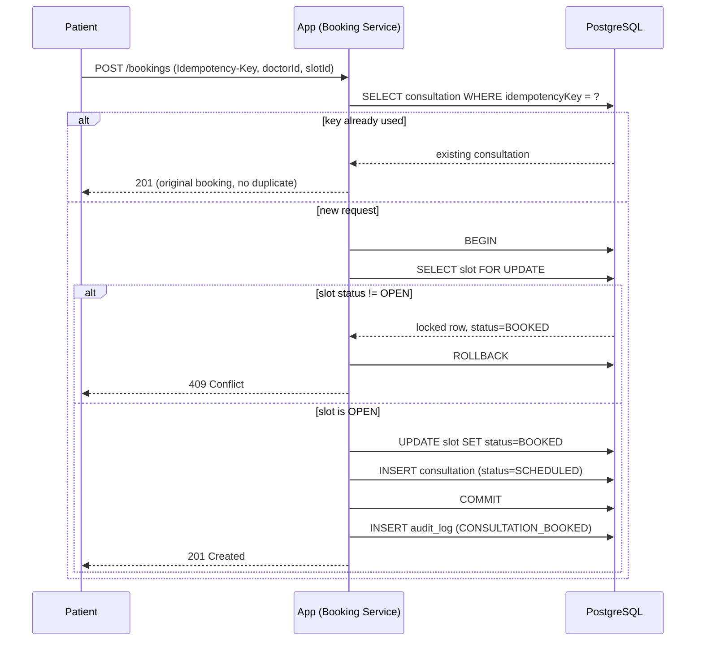
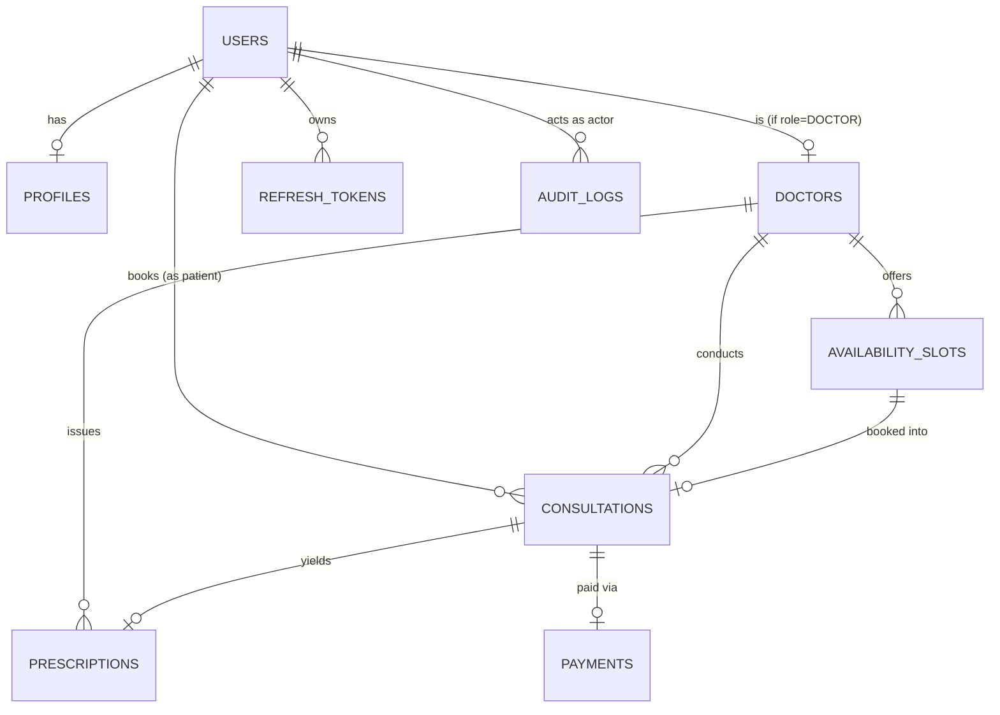

# Amrutam Telemedicine Backend — Architecture

## 1. High-Level Architecture & Data Flow

```mermaid
flowchart LR
    Client[Client / Postman / Swagger UI] -->|HTTPS| ALB[Load Balancer]
    ALB --> App[Express App\n(modules: auth, doctors, booking,\nconsultations, prescriptions,\npayments, search, admin, audit)]
    App --> PG[(PostgreSQL\nprimary + read replica)]
    App --> Redis[(Redis\ncache + BullMQ)]
    App -.enqueue.-> Worker[Worker Process\n(pdf-generation,\nnotifications,\nanalytics-rollup)]
    Worker --> PG
    Worker --> Redis
    App -->|OTLP| Jaeger[Jaeger]
    App -->|/metrics| Prometheus[Prometheus]
    App -->|stdout JSON| Promtail[Promtail] --> Loki[Loki]
    Prometheus --> Grafana
    Loki --> Grafana
    Jaeger --> Grafana
```

A single modular Express service handles all synchronous request/response
flows; heavy or non-latency-sensitive work (PDF generation, notifications,
nightly analytics rollups) is pushed onto a separate worker process reading
from BullMQ/Redis queues, so API write latency (p95 <500ms target) isn't
coupled to PDF rendering or notification delivery time. Both processes read
the same PostgreSQL database and emit traces/metrics/logs to the
observability stack.

## 2. Booking Flow Sequence Diagram



The `SELECT ... FOR UPDATE` inside the transaction is what makes two
concurrent requests for the same slot resolve deterministically: the second
transaction blocks on the row lock until the first commits or rolls back,
then re-reads the now-updated status and gets a clean 409 instead of a
constraint violation or a double-booked slot.

## 3. ER Diagram



## 4. API Schema

See `docs/openapi.yaml`, served interactively at `/docs` (Swagger UI) when
the app is running. REST + OpenAPI 3.0 was chosen over GraphQL because it
is simpler to secure per-route (rate limits, RBAC) and simpler for a
reviewer to exercise quickly.

## 5. Retry & Backoff Strategies

- **Async jobs** (BullMQ): 3 attempts, exponential backoff starting at 2s
  (`{ type: 'exponential', delay: 2000 }`), applied uniformly to
  pdf-generation, notifications, and analytics-rollup queues.
- **Outbound calls** (mock payment gateway): `retryWithBackoff` helper
  (`src/common/retry.ts`) — 3 attempts, base delay 200ms with jitter,
  applied only to the gateway call itself. The mock gateway does not
  currently distinguish 4xx-style (declined) failures from transient
  (timeout) failures — `retryWithBackoff` retries any thrown
  `PaymentGatewayError` uniformly up to 3 attempts. A production integration
  with a real gateway would need to inspect the error/response code and skip
  retries for definite rejections (e.g., card declined), retrying only on
  timeouts/5xx — this distinction is not yet implemented in the mock.

## 6. Data Partitioning

`audit_logs` is physically range-partitioned by month on `createdAt`
(see `prisma/migrations/*_partition_audit_logs`), because audit rows are
append-only, grow without bound, and are queried almost exclusively by
recent time range — partition pruning keeps those queries fast without a
full-table scan as history accumulates. The same strategy is the
documented (not yet applied) plan for `consultations` once volume
approaches the 100k/day target: monthly partitions keyed on
`scheduledAt`, with a retention job dropping partitions older than the
compliance retention window rather than deleting rows individually.

## 7. Caching & Concurrency Handling

- **Caching**: Redis cache-aside for doctor search results (30s TTL,
  Task 15) and would extend to doctor profile reads at higher scale;
  explicit invalidation on doctor/slot writes keeps the cache from
  serving stale availability past its TTL window.
- **Concurrency**: the booking flow (§2) uses row-level `SELECT ... FOR
  UPDATE` locking rather than optimistic concurrency, because booking
  contention is exactly the case where a client should get an immediate,
  correct 409 rather than a false success that's later revealed to
  conflict. The `availability_slots.version` column is retained for any
  future optimistic-locking need (e.g., doctor editing slot metadata) but
  is not the mechanism guarding the booking write itself.

## 8. Transaction Management & Sagas

Booking (Task 11) is a single ACID transaction — it never needs saga
semantics because slot-lock and consultation-create are one atomic
Postgres transaction. Payment (Task 14) is where a saga is required: slot
is already held (booked) by the time payment is attempted, and a single
Postgres transaction can't span both "charge the mock gateway" (an
external call) and "release the slot." The `PaymentsService.pay` flow
instead implements an orchestrated saga: attempt the charge (with
retries) → on success, mark payment `SUCCEEDED`; on exhausted-retry
failure, mark payment `FAILED` **and** run the compensating action
(`BookingRepository.releaseSlot`, flipping the slot back to `OPEN`),
writing an audit log entry (`BOOKING_COMPENSATED_SLOT_RELEASED`) so the
compensation itself is traceable. The compensation steps themselves are
wrapped in an inner try/catch: if any of `markFailed`, `releaseSlot`, or
the compensation audit write fails, that failure is logged but the original
payment-gateway error is still what propagates to the caller — a partial
failure during compensation never masks the fact that the payment failed,
though it also does not yet retry the compensation step itself (a residual
gap noted in the security/threat model).

## 9. Backup & DR Strategy

- **RDS PostgreSQL** (documented in Terraform, Task 21): Multi-AZ
  deployment for automatic failover, 7-day automated backup retention,
  point-in-time recovery (PITR) via continuous WAL archiving — target RPO
  under 5 minutes.
- **Cross-region**: a read replica in a second region is the documented
  next step for disaster recovery beyond AZ failure, promotable to
  primary if the primary region is lost — target RTO under 30 minutes for
  that promotion + DNS cutover.
- **Redis**: ElastiCache replication group with automatic failover
  (Task 21); since Redis here holds only cache and job-queue state (not
  source-of-truth data), a full data loss is recoverable by replaying
  from Postgres and re-enqueuing pending jobs, not a DR-critical path.
- **Application**: stateless ECS Fargate tasks behind an ALB — recovery
  from an AZ or task failure is horizontal (new tasks scheduled), not a
  backup/restore operation.

## Scale & Latency Targets

At the assignment's target of 100k consultations/day (~1.15 writes/sec
average, with real-world peaking well above that), the read path (search,
availability listing) is the higher-volume path and is served by Redis
caching + indexed Postgres queries; the write path (booking, payment) is
kept correct under contention by row-level locking rather than optimistic
retry loops, trading a small amount of write throughput under heavy
same-slot contention for correctness guarantees that don't require
client-side retry logic.
